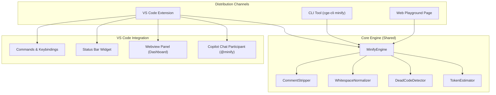

# 🧹 AI Minify: Smart Token Optimizer for AI Coding Tools

> **Project Codename:** AI Minify  
> **Parent Project:** [CGE Compiler](file:///Users/anilalapati/Development/cge-compiler)  
> **Goal:** Surgically strip comments, dead code, and unnecessary whitespace from source files before they reach AI models — saving 20-40% token costs with zero reasoning degradation.

---

## Background & Motivation

### The Problem
Every AI coding tool (Copilot, Cursor, Gemini Code Assist, Windsurf) reads source files character-by-character. The tokenizer charges for **everything** — comments, blank lines, license headers, commented-out dead code. None of these tokens improve the model's reasoning about the code.

### Why This Isn't Phase 1
Phase 1 (CGE Compression) failed because it **changed the language** — converting TypeScript syntax into a custom CGE notation, destroying framework metadata (decorators, types) that LLMs rely on.

AI Minify does **not** change the language. It keeps every line of executable code, every decorator, every type annotation — exactly as-is. It only removes text that is provably not part of the program's semantics:

| What Phase 1 Stripped | What AI Minify Strips |
|---|---|
| ❌ Decorators (`@UseGuards`) | ✅ Commented-out dead code (`// const old = 5;`) |
| ❌ Curly braces, semicolons | ✅ License headers (MIT, Apache boilerplate) |
| ❌ Type annotations | ✅ Excessive blank lines (3+ → 1) |
| ❌ Framework syntax | ✅ Changelog comments (`// v2.1 fix by John`) |
| ❌ Import structure | ✅ Trailing whitespace |

> [!IMPORTANT]
> **Core Principle:** AI Minify is a **cosmetic optimizer**, not a **structural transformer**. The output must compile identically to the input. If you diff the AST of input vs output, they must be identical.

---

## User Review Required

> [!WARNING]
> **Key Design Decision: Should we keep or strip JSDoc/docstrings by default?**
> 
> JSDoc (`/** ... */`) and Python docstrings (`""" ... """`) are a gray area:
> - **Keep them:** They contain type hints, parameter descriptions, and API contracts that help the AI understand function intent.
> - **Strip them:** They can be 30-50% of a file's comment weight, especially in well-documented libraries.
> 
> **Proposed approach:** Keep JSDoc/docstrings by default, but provide a toggle ("Aggressive Mode") that strips them too. The validation experiment (Phase 0) will test both modes.

> [!IMPORTANT]
> **Naming Decision:** The VS Code extension needs a marketplace name. Options:
> 1. `AI Minify` — Clear, descriptive
> 2. `Token Trim` — Catchy, concise
> 3. `Context Slim` — References context windows
> 4. `AI Minify by CGE` — Ties to our brand
> 
> What's your preference?

---

## Open Questions

1. **Pricing model for the extension?** Free (open source), freemium (free for single files, paid for project-wide), or fully open?
2. **Should the web playground be a new page or integrated into the existing [CGE Playground](file:///Users/anilalapati/Development/cge-compiler/index.html)?** I'm proposing a new dedicated page (`/minify` or `minify.html`) with its own branding, linked from the main site.
3. **Priority order for language support?** I'm proposing: TypeScript/JavaScript → Python → Rust → Go → C++ (matching our existing parser capabilities).

---

## Architecture Overview



---

## Proposed Changes

### Phase 0: Validation Experiment (2 hours) — MUST DO FIRST

Before building anything, we scientifically validate that comment stripping doesn't hurt reasoning.

#### [NEW] `scripts/validate_minify_hypothesis.ts`

A quick experiment script that:
1. Takes an existing benchmark repo (e.g., `nestjs-realworld`)
2. Creates a "minified" copy with all comments and excessive whitespace stripped
3. Runs the **exact same architectural reasoning benchmark** from Phase 3 on both versions
4. Compares accuracy scores and token counts

```typescript
// Pseudocode
interface MinifyExperimentResult {
  repo: string;
  rawAccuracy: number;
  rawTokens: number;
  minifiedAccuracy: number;
  minifiedTokens: number;
  tokenSavingsPercent: number;
  accuracyDelta: number; // Must be >= 0 to proceed
}
```

**Decision Gate:**
- ✅ If `accuracyDelta >= 0` AND `tokenSavingsPercent >= 10%` → Proceed to Phase 1
- ❌ If `accuracyDelta < -5%` → Kill the project, analyze why
- ⚠️ If `accuracyDelta` is between -5% and 0% → Run deeper analysis on which comment types matter

---

### Phase 1: Core Minify Engine (1-2 days)

The shared engine that powers all distribution channels. Written in TypeScript, works in both Node.js and browser environments.

#### [NEW] `src/minify/minify_engine.ts`

The main orchestrator. Takes raw source code + language + options, returns minified code + metrics.

```typescript
export interface MinifyOptions {
  stripLineComments: boolean;        // Strip // comments (default: true)
  stripBlockComments: boolean;       // Strip /* */ comments (default: true)
  stripDocComments: boolean;         // Strip /** */ and """ """ (default: false — SAFE MODE)
  stripDeadCode: boolean;            // Strip commented-out code lines (default: true)
  stripLicenseHeaders: boolean;      // Strip SPDX/MIT/Apache headers (default: true)
  normalizeWhitespace: boolean;      // Collapse 3+ blank lines → 1 (default: true)
  stripTrailingWhitespace: boolean;  // Remove trailing spaces (default: true)
  preserveTodos: boolean;            // Keep TODO/FIXME/HACK comments (default: true)
}

export interface MinifyResult {
  output: string;                    // The minified source code
  originalTokens: number;           // Estimated token count (original)
  minifiedTokens: number;           // Estimated token count (minified)
  savings: {
    totalTokensSaved: number;
    percentSaved: number;
    breakdown: {
      lineComments: number;          // Tokens saved from // comments
      blockComments: number;         // Tokens saved from /* */ comments
      docComments: number;           // Tokens saved from /** */ comments
      deadCode: number;              // Tokens saved from commented-out code
      licenseHeaders: number;        // Tokens saved from license blocks
      whitespace: number;            // Tokens saved from whitespace normalization
    }
  };
}

export class MinifyEngine {
  minify(code: string, language: string, options?: Partial<MinifyOptions>): MinifyResult;
}
```

#### [NEW] `src/minify/comment_stripper.ts`

Language-aware comment stripping. Uses regex patterns (not full AST) for speed, but is smart about:
- **Not stripping inside strings:** `const msg = "// this is not a comment";`
- **Detecting commented-out code vs. human comments:** Uses heuristics like:
  - Line starts with `//` followed by valid code syntax (`const`, `let`, `if`, `return`, `import`, `{`, `}`)
  - Line matches common "disabled code" patterns
- **Preserving TODO/FIXME:** Configurable, keeps `// TODO:`, `// FIXME:`, `// HACK:` by default
- **License header detection:** Recognizes SPDX identifiers, MIT/Apache/GPL text blocks at file top

Supported languages (matching existing parsers in [src/](file:///Users/anilalapati/Development/cge-compiler/src)):
| Language | Line Comment | Block Comment | Doc Comment |
|---|---|---|---|
| TypeScript/JS | `//` | `/* */` | `/** */` |
| Python | `#` | `""" """` (multiline strings) | `""" """` (docstrings) |
| Rust | `//` | `/* */` | `///`, `//!` |
| Go | `//` | `/* */` | (godoc convention) |
| C++ | `//` | `/* */` | `/** */` |

#### [NEW] `src/minify/whitespace_normalizer.ts`

- Collapse 3+ consecutive blank lines → 1 blank line
- Strip trailing whitespace from every line
- Optionally: reduce indentation width (4 spaces → 2 spaces) — OFF by default, debatable

#### [NEW] `src/minify/dead_code_detector.ts`

Detects and strips lines that are commented-out source code (not human-written comments):

```typescript
// These would be stripped (commented-out code):
// const oldHandler = async (req, res) => {
//   return res.json({ status: 'ok' });
// };

// These would be KEPT (human-written comments):
// This function handles user authentication
// Make sure to validate the token before proceeding
```

Heuristic detection:
- Contains assignment operators (`=`, `+=`, `-=`)
- Starts with language keywords (`const`, `let`, `var`, `if`, `for`, `return`, `import`, `class`, `function`)
- Contains brackets/braces patterns (`{`, `}`, `(`, `)`)
- Contains method calls (`foo.bar()`, `this.something`)
- Contains type annotations (`: string`, `: number`)
- Consecutive commented lines (3+ in a row that look like code = almost certainly dead code)

#### [NEW] `src/minify/token_estimator.ts`

Fast approximate token counter. We don't need exact GPT tokenizer accuracy — a good approximation (±5%) is sufficient for the UI.

Uses the simple heuristic: `tokens ≈ characters / 3.5` for code, with adjustments for language-specific patterns.

Optionally integrates `gpt-tokenizer` npm package for exact counts (Node.js only, not browser).

---

### Phase 2: VS Code Extension (2-3 days)

#### Extension Structure

```
vscode-ai-minify/
├── package.json              # Extension manifest
├── tsconfig.json
├── src/
│   ├── extension.ts          # Activation & command registration
│   ├── commands/
│   │   ├── minify_file.ts    # Minify current file to clipboard
│   │   ├── minify_selection.ts  # Minify selected text
│   │   ├── show_savings.ts   # Show token savings panel
│   │   └── toggle_mode.ts    # Toggle safe/aggressive mode
│   ├── providers/
│   │   ├── status_bar.ts     # Status bar widget ("🧹 Save 23%")
│   │   ├── code_lens.ts      # Inline lens showing per-function token cost
│   │   └── webview_panel.ts  # Rich dashboard panel
│   ├── chat/
│   │   └── participant.ts    # @minify Copilot Chat Participant
│   └── core/                 # Symlink/copy of src/minify/ engine
├── media/
│   ├── icon.png              # Extension icon
│   └── dashboard.html        # Webview dashboard HTML
└── README.md                 # Marketplace README
```

#### [NEW] `vscode-ai-minify/package.json` (Extension Manifest)

Key extension contributions:
```json
{
  "name": "ai-minify",
  "displayName": "AI Minify — Smart Token Optimizer",
  "description": "Strip comments, dead code, and whitespace to save 20-40% on AI token costs",
  "version": "0.1.0",
  "engines": { "vscode": "^1.95.0" },
  "categories": ["Other", "Machine Learning"],
  "activationEvents": ["onStartupFinished"],
  "contributes": {
    "commands": [
      {
        "command": "aiMinify.minifyToClipboard",
        "title": "AI Minify: Copy Minified Code to Clipboard"
      },
      {
        "command": "aiMinify.minifySelection",
        "title": "AI Minify: Minify Selection"
      },
      {
        "command": "aiMinify.showDashboard",
        "title": "AI Minify: Show Token Savings Dashboard"
      },
      {
        "command": "aiMinify.toggleMode",
        "title": "AI Minify: Toggle Safe/Aggressive Mode"
      }
    ],
    "keybindings": [
      {
        "command": "aiMinify.minifyToClipboard",
        "key": "ctrl+shift+m",
        "mac": "cmd+shift+m"
      }
    ],
    "configuration": {
      "title": "AI Minify",
      "properties": {
        "aiMinify.mode": {
          "type": "string",
          "enum": ["safe", "aggressive"],
          "default": "safe",
          "description": "Safe mode keeps docstrings/JSDoc. Aggressive mode strips everything."
        },
        "aiMinify.preserveTodos": {
          "type": "boolean",
          "default": true,
          "description": "Keep TODO/FIXME/HACK comments"
        },
        "aiMinify.showStatusBar": {
          "type": "boolean",
          "default": true,
          "description": "Show token savings in status bar"
        }
      }
    },
    "chatParticipants": [
      {
        "id": "ai-minify.minify",
        "fullName": "AI Minify",
        "name": "minify",
        "description": "Strips comments and dead code before sending to Copilot",
        "isSticky": false
      }
    ]
  }
}
```

#### Feature: Status Bar Widget

A persistent status bar item that shows real-time token savings for the current file:

```
🧹 Save 847 tokens (24%) | Safe Mode
```

- Updates on file change / active editor change
- Click to open the dashboard
- Shows green/yellow/red based on savings potential

#### Feature: Copilot Chat Participant (`@minify`)

Users can type `@minify explain this controller` in Copilot Chat:
1. The participant intercepts the request
2. Reads the referenced file(s)
3. Runs MinifyEngine on them
4. Forwards the minified code + user's question to Copilot's language model
5. Returns the response

This is the **killer feature** — it transparently saves tokens on every Copilot Chat interaction.

#### Feature: Webview Dashboard

A rich HTML panel inside VS Code showing:
- Current file token analysis (pie chart: code vs comments vs whitespace vs dead code)
- Project-wide scan results (total savings across all files)
- Per-file breakdown table (sortable by savings potential)
- Cost estimator (select your model → see dollar savings)
- Before/after diff view

---

### Phase 3: CLI Integration (1 day)

Integrate into the existing [CLI tool](file:///Users/anilalapati/Development/cge-compiler/src/cli/index.ts).

#### [MODIFY] `src/cli/index.ts`

Add a new `minify` command alongside the existing `build` command:

```bash
# Minify a single file
cge-cli minify src/auth.controller.ts

# Minify an entire directory (creates .minified/ output)
cge-cli minify ./src --output .minified/

# Minify and copy to clipboard
cge-cli minify src/auth.controller.ts --clipboard

# Show savings report without modifying files
cge-cli minify ./src --dry-run --report

# Aggressive mode (strips docstrings too)
cge-cli minify ./src --aggressive
```

Output example:
```
🧹 AI Minify Report
━━━━━━━━━━━━━━━━━━━━━━━━━━━━━━━━━━━━━━━━━━━━━━━━━━━━━━
📁 Files scanned:        47
📊 Original tokens:      89,340
✂️  Minified tokens:      67,255
💰 Tokens saved:         22,085 (24.7%)

Top savings by file:
  auth.service.ts        -3,420 tokens (38% saved) — 12 dead code blocks
  user.controller.ts     -2,100 tokens (31% saved) — license header + changelog
  database.config.ts     -1,800 tokens (45% saved) — 200 lines of commented-out config
━━━━━━━━━━━━━━━━━━━━━━━━━━━━━━━━━━━━━━━━━━━━━━━━━━━━━━
💡 Estimated monthly savings at 50 queries/day:
   GPT-4o:   $0.83/month
   Claude:   $0.99/month
   Opus:     $4.96/month
```

---

### Phase 4: Web Playground Page (2 days)

A dedicated web page for AI Minify, following the same design system as the existing [CGE Playground](file:///Users/anilalapati/Development/cge-compiler/index.html).

#### [NEW] `minify.html`

A standalone page at `cge-compiler.vercel.app/minify` with:

**Hero Section:**
- "Stop paying for comments." headline
- Animated token counter showing savings
- Quick stats (avg 20-40% savings, zero reasoning impact)

**Interactive Workspace:**
- Left panel: Paste or upload code (same editor style as CGE playground)
- Right panel: Minified output with diff highlighting (red = removed, green = kept)
- Middle bridge: Animated arrow showing the transformation

**Controls:**
- Language selector (auto-detect from code)
- Mode toggle: Safe (keep docstrings) / Aggressive (strip all)
- Checkboxes: Strip dead code ✓, Strip license headers ✓, Normalize whitespace ✓, Keep TODOs ✓

**Metrics Dashboard (below workspace):**
- Token savings ring (reuse the existing ring chart component from CGE playground)
- Breakdown: pie chart showing where tokens were saved (comments vs dead code vs whitespace)
- Cost estimator: Model selector (GPT-4o / Claude / Opus / Gemini) × queries/day slider → monthly savings

**Project Zip Upload:**
- Reuse the existing zip upload infrastructure from the CGE playground
- Upload a .zip → scan all files → show aggregate savings report
- Per-file breakdown table with sortable columns

#### [NEW] `minify.css`

Extends the existing [playground.css](file:///Users/anilalapati/Development/cge-compiler/playground.css) design system:
- Same dark theme, glassmorphism cards, gradient accents
- New accent color scheme: emerald/teal (differentiate from CGE's blue/purple)
- Diff highlighting styles (red strikethrough for removed, green highlight for kept)

#### [NEW] `minify.js`

Client-side minification engine (browser-compatible version of the core engine):
- Uses the same `MinifyEngine` logic but compiled for browser
- Web Worker support for processing large zip files (reuse pattern from [compiler_worker.js](file:///Users/anilalapati/Development/cge-compiler/compiler_worker.js))

#### [MODIFY] `index.html`

Add a navigation link/banner to the new Minify page:
```html
<div class="nav-banner">
  🆕 <a href="minify.html">Try AI Minify</a> — Save 20-40% on AI token costs
</div>
```

---

### Phase 5: Multi-IDE Expansion (Future)

Once validated and polished on VS Code + Copilot:

| IDE / Tool | Integration Method | Priority |
|---|---|---|
| **Cursor** | VS Code extension (compatible) | 🟢 Free — same .vsix works |
| **Windsurf** | VS Code extension (compatible) | 🟢 Free — same .vsix works |
| **JetBrains (IntelliJ, WebStorm)** | JetBrains Plugin (Kotlin/Java) | 🟡 Requires separate plugin |
| **Zed** | Zed Extension API | 🟡 Growing user base |
| **Neovim** | Lua plugin wrapping CLI | 🟡 Power user audience |
| **Generic API Proxy** | HTTP middleware that minifies before forwarding to OpenAI/Anthropic API | 🔴 Complex but highest enterprise value |

---

## File Structure Summary

```
cge-compiler/
├── src/
│   ├── minify/                          # Core engine (shared)
│   │   ├── minify_engine.ts             # [NEW] Main orchestrator
│   │   ├── comment_stripper.ts          # [NEW] Language-aware comment removal
│   │   ├── whitespace_normalizer.ts     # [NEW] Whitespace cleanup
│   │   ├── dead_code_detector.ts        # [NEW] Commented-out code detection
│   │   └── token_estimator.ts           # [NEW] Token count approximation
│   └── cli/
│       └── index.ts                     # [MODIFY] Add 'minify' command
├── scripts/
│   └── validate_minify_hypothesis.ts    # [NEW] Phase 0 validation experiment
├── minify.html                          # [NEW] Web playground page
├── minify.css                           # [NEW] Web playground styles
├── minify.js                            # [NEW] Browser-side minify engine
├── index.html                           # [MODIFY] Add nav link to minify page
└── vscode-ai-minify/                    # [NEW] VS Code extension (separate dir)
    ├── package.json
    ├── tsconfig.json
    ├── src/
    │   ├── extension.ts
    │   ├── commands/
    │   ├── providers/
    │   └── chat/
    ├── media/
    └── README.md
```

---

## Verification Plan

### Phase 0: Automated Validation
```bash
# Run the hypothesis validation experiment
npx ts-node scripts/validate_minify_hypothesis.ts

# Expected output: accuracy comparison table
# PASS criteria: minified accuracy >= raw accuracy (within -5% tolerance)
```

### Phase 1: Core Engine Tests
```bash
# Unit tests for the minify engine
npx ts-node src/minify/__tests__/comment_stripper.test.ts
npx ts-node src/minify/__tests__/dead_code_detector.test.ts
npx ts-node src/minify/__tests__/whitespace_normalizer.test.ts

# Integration test: minified output must have identical AST to input
# (compile both with TypeScript compiler, compare AST structures)
```

### Phase 2: VS Code Extension
- Install the .vsix locally in VS Code
- Test commands: Cmd+Shift+M copies minified code to clipboard
- Verify status bar updates on file switch
- Test @minify chat participant in Copilot Chat
- Test with real files from our benchmark repos

### Phase 3: CLI
```bash
# Test CLI minify command
npm run build:cli
./dist/cli.js minify ./test_files --dry-run --report
```

### Phase 4: Web Playground
- Deploy to Vercel preview
- Test single-file paste → minify → compare tokens
- Test zip upload → project-wide report
- Verify all cost estimator calculations

### Manual Verification
- Have the user test the VS Code extension with their daily workflow
- Compare Copilot responses with and without @minify
- Collect real-world token savings data from 5+ projects

---

## Implementation Priority & Timeline

| Phase | Effort | Deliverable | Dependency |
|---|---|---|---|
| **Phase 0: Validate** | 2 hours | Experiment results — GO/NO-GO | None |
| **Phase 1: Core Engine** | 1-2 days | `src/minify/` module | Phase 0 pass |
| **Phase 2: VS Code Extension** | 2-3 days | `.vsix` installable | Phase 1 |
| **Phase 3: CLI** | 1 day | `cge-cli minify` command | Phase 1 |
| **Phase 4: Web Playground** | 2 days | `minify.html` on Vercel | Phase 1 |
| **Phase 5: Multi-IDE** | Ongoing | JetBrains, Zed, API proxy | Phase 2 |

**Total to MVP (Phases 0-2): ~4-5 days**
**Total to full product (Phases 0-4): ~7-9 days**
